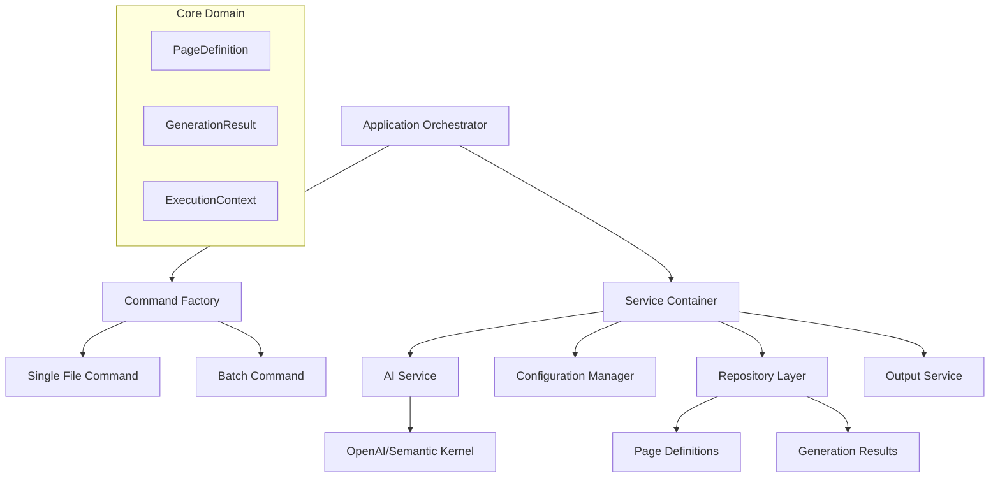

# Production-Grade Playwright Test Generation System

## 📖 Table of Contents

- [Overview](#overview)
- [Quick Start & Example](#quick-start--example)
- [Key Features](#key-features)
- [Architecture](#architecture)
- [Course Modules](#course-modules)
- [Technical Stack](#technical-stack)
- [Benefits](#benefits)
- [Prerequisites](#prerequisites)

---

## Overview

The **Production-Grade Playwright Test Generation System** is a sophisticated AI-powered solution that automatically generates high-quality Playwright Page Object Model classes from markdown page descriptions. Built with clean architecture principles and modern async patterns, this system provides a professional-grade foundation for automated test generation in enterprise environments.

You can access the Jupyter workbook [here](./AgenticPlaywrightTestGeneration.ipynb).

### 🎧 **Complete Learning Experience** (49:31)

This project includes comprehensive learning materials designed for both visual and auditory learners:

- **📚 Interactive Documentation**: Detailed technical documentation with live code examples
- **🎵 Audio Course**: Complete narrated modules covering all architectural concepts and implementations
- **💻 Production Code**: Full working implementation demonstrating enterprise patterns
- **🔧 Hands-On Examples**: Real-world scenarios and complex page generation demonstrations

The **audio course** provides an in-depth walkthrough of each module, making it perfect for developers who prefer to learn while commuting, exercising, or working on other tasks. Each module builds upon the previous, ensuring a comprehensive understanding of clean architecture principles in Python. 

You can access this course in [Assets](./Assets/AgenticPlaywrightTestGeneration.mp3)

### 🎯 Project Goals

- **Automated Test Generation**: Transform page descriptions into production-ready Playwright code
- **Clean Architecture**: Implement SOLID principles with dependency injection and separation of concerns
- **Enterprise Ready**: Production-grade error handling, logging, and configuration management
- **Extensible Design**: Modular architecture supporting multiple AI providers and output formats
- **Type Safety**: Comprehensive type hints and Pydantic validation throughout

### 📖 **Learning Approach**

Whether you prefer to **read**, **listen**, or **code along**, this comprehensive package provides:

1. **Audio-First Learning**: Complete narrated course covering architectural concepts
2. **Visual Documentation**: Detailed code examples and explanations
3. **Practical Implementation**: Working system you can extend and customize
4. **Multiple Learning Styles**: Supporting both auditory and visual learners

---

## Quick Start & Example

See the system in action with a complex e-commerce page generation:

### 1. Environment Setup

```python
# Install dependencies
%pip install openai semantic-kernel pydantic python-dotenv

# Set your OpenAI API key
import os
os.environ['OPENAI_API_KEY'] = 'sk-your-api-key-here'
```

### 2. Define Complex Page Requirements

```python
from application import PlaywrightTestGenerationApplication
from models import PageDefinition, ExecutionMode

# Create complex e-commerce product page definition
product_page_def = PageDefinition(
    name="ProductDetailPage",
    content="""
    # E-commerce Product Detail Page
    
    ## Page Components
    ### Product Information Section
    - Product title and brand
    - Price display with discounts
    - Product image gallery with zoom
    - Star rating and review count
    - Product description and specifications
    
    ### Interactive Features
    - Size/color variant selector
    - Quantity adjuster with validation
    - Add to cart with inventory check
    - Add to wishlist functionality
    - Share product options
    
    ## Primary Tasks
    ### View Product Details
    #### Steps
    1. Navigate to product page via URL
    2. Verify product information loads correctly
    3. Check image gallery functionality
    4. Validate pricing and discount display
    5. Confirm rating and review data
    
    ### Configure Product Options
    #### Steps
    1. Select product size from dropdown
    2. Choose color variant from swatches
    3. Adjust quantity using stepper controls
    4. Validate stock availability updates
    5. Verify price updates with selections
    
    ### Add Product to Cart
    #### Steps
    1. Configure all required product options
    2. Set desired quantity (validate max limits)
    3. Click add to cart button
    4. Wait for cart update confirmation
    5. Verify cart badge/counter updates
    6. Handle out-of-stock scenarios
    
    ### Manage Wishlist
    #### Steps
    1. Click wishlist heart icon
    2. Handle authentication if required
    3. Confirm item added to wishlist
    4. Verify wishlist counter updates
    5. Toggle item removal from wishlist
    
    ### Browse Product Reviews
    #### Steps
    1. Scroll to reviews section
    2. Load additional reviews via pagination
    3. Filter reviews by rating
    4. Sort reviews by date/helpfulness
    5. Expand/collapse detailed reviews
    
    ## Error Scenarios
    - Handle out of stock products
    - Validate maximum quantity limits
    - Manage authentication requirements
    - Network timeout handling
    """
)
```

### 3. Generate Production-Ready Code

```python
# Generate comprehensive page object
app = PlaywrightTestGenerationApplication()
async with app.application_context():
    results = await app.execute_generation(
        mode=ExecutionMode.SINGLE_FILE,
        page_definition=product_page_def
    )
```

### 4. Generated Output (Fully Functional Page Object)

```python
from typing import Optional, List
from playwright.async_api import Page, Locator

class ProductDetailPage(BasePage):
    """
    Page object for e-commerce product detail functionality.
    
    Handles complex product interactions including variant selection,
    cart management, wishlist operations, and review browsing.
    """
    
    def __init__(self, page: Page) -> None:
        """Initialize product detail page with all interactive elements."""
        super().__init__(page)
        
        # Product Information Elements
        self.product_title = page.locator('[data-testid="product-title"]')
        self.product_brand = page.locator('[data-testid="product-brand"]')
        self.product_price = page.locator('[data-testid="product-price"]')
        self.discount_badge = page.locator('[data-testid="discount-badge"]')
        self.product_rating = page.locator('[data-testid="product-rating"]')
        self.review_count = page.locator('[data-testid="review-count"]')
        
        # Image Gallery Elements
        self.main_product_image = page.locator('[data-testid="main-product-image"]')
        self.image_thumbnails = page.locator('[data-testid="image-thumbnail"]')
        self.image_zoom_trigger = page.locator('[data-testid="image-zoom"]')
        
        # Product Configuration Elements
        self.size_selector = page.locator('[data-testid="size-selector"]')
        self.color_swatches = page.locator('[data-testid="color-swatch"]')
        self.quantity_input = page.locator('[data-testid="quantity-input"]')
        self.quantity_increase = page.locator('[data-testid="quantity-increase"]')
        self.quantity_decrease = page.locator('[data-testid="quantity-decrease"]')
        
        # Action Elements
        self.add_to_cart_button = page.locator('[data-testid="add-to-cart"]')
        self.wishlist_button = page.locator('[data-testid="wishlist-toggle"]')
        self.share_button = page.locator('[data-testid="share-product"]')
        
        # Feedback Elements
        self.cart_confirmation = page.locator('[data-testid="cart-confirmation"]')
        self.cart_counter = page.locator('[data-testid="cart-counter"]')
        self.stock_indicator = page.locator('[data-testid="stock-status"]')
        
        # Reviews Section Elements
        self.reviews_section = page.locator('[data-testid="reviews-section"]')
        self.review_filter = page.locator('[data-testid="review-filter"]')
        self.review_sort = page.locator('[data-testid="review-sort"]')
        self.load_more_reviews = page.locator('[data-testid="load-more-reviews"]')

    async def view_product_details(self, product_url: str) -> None:
        """
        Navigate to product page and verify all details load correctly.
        
        Args:
            product_url: The full URL of the product to view
        """
        await self.navigate(product_url)
        await self.wait_for_element('[data-testid="product-title"]')
        await self.wait_for_element('[data-testid="product-price"]')
        await self.wait_for_element('[data-testid="main-product-image"]')

    async def select_product_variant(self, size: str, color: str) -> None:
        """
        Configure product options by selecting size and color variants.
        
        Args:
            size: The size option to select
            color: The color variant to choose
        """
        # Select size from dropdown
        await self.size_selector.click()
        await self.page.locator(f'[data-testid="size-option"][data-value="{size}"]').click()
        
        # Select color from swatches
        await self.page.locator(f'[data-testid="color-swatch"][data-color="{color}"]').click()
        
        # Wait for price and stock updates
        await self.wait_for_element('[data-testid="stock-status"]')

    async def add_to_cart(self, size: str, color: str, quantity: int = 1) -> bool:
        """
        Complete product configuration and add to cart.
        
        Args:
            size: Product size selection
            color: Product color selection  
            quantity: Number of items to add
            
        Returns:
            True if successfully added to cart, False if out of stock
        """
        # Configure product options
        await self.select_product_variant(size, color)
        await self.set_quantity(quantity)
        
        # Check stock availability
        stock_text = await self.stock_indicator.text_content()
        if "out of stock" in stock_text.lower():
            return False
        
        # Add to cart
        await self.add_to_cart_button.click()
        
        # Wait for confirmation
        await self.wait_for_element('[data-testid="cart-confirmation"]', state="visible")
        
        # Verify cart counter updated
        await self.wait_for_element('[data-testid="cart-counter"]')
        return True

    async def toggle_wishlist(self) -> bool:
        """
        Add or remove product from wishlist.
        
        Returns:
            True if item is now in wishlist, False if removed
        """
        # Get current wishlist state
        is_active = await self.wishlist_button.get_attribute("data-active") == "true"
        
        # Toggle wishlist
        await self.wishlist_button.click()
        
        # Handle potential authentication modal
        auth_modal = self.page.locator('[data-testid="auth-modal"]')
        if await auth_modal.is_visible():
            # Handle authentication requirement
            pass
        
        # Return new state (opposite of previous)
        return not is_active

    async def browse_reviews(self, filter_rating: Optional[int] = None, 
                           sort_by: str = "newest") -> List[str]:
        """
        Browse and filter product reviews.
        
        Args:
            filter_rating: Optional rating filter (1-5 stars)
            sort_by: Sort order - "newest", "oldest", "helpful"
            
        Returns:
            List of review text content
        """
        # Navigate to reviews section
        await self.reviews_section.scroll_into_view_if_needed()
        
        # Apply rating filter if specified
        if filter_rating:
            await self.review_filter.click()
            await self.page.locator(f'[data-testid="rating-filter-{filter_rating}"]').click()
        
        # Apply sorting
        await self.review_sort.click()
        await self.page.locator(f'[data-testid="sort-{sort_by}"]').click()
        
        # Load additional reviews if available
        while await self.load_more_reviews.is_visible():
            await self.load_more_reviews.click()
            await self.page.wait_for_timeout(1000)  # Wait for reviews to load
        
        # Extract review content
        reviews = await self.page.locator('[data-testid="review-text"]').all_text_contents()
        return reviews

    async def get_product_info(self) -> dict:
        """
        Extract comprehensive product information.
        
        Returns:
            Dictionary containing all product details
        """
        return {
            "title": await self.product_title.text_content(),
            "brand": await self.product_brand.text_content(),
            "price": await self.product_price.text_content(),
            "rating": await self.product_rating.text_content(),
            "review_count": await self.review_count.text_content(),
            "stock_status": await self.stock_indicator.text_content()
        }
```

### 5. Batch Processing for Multiple Pages

```python
# Generate multiple complex pages simultaneously
page_definitions = [
    ProductDetailPage_def,
    ShoppingCartPage_def,
    CheckoutPage_def,
    UserDashboardPage_def
]

async with app.application_context():
    batch_results = await app.execute_generation(
        mode=ExecutionMode.DIRECTORY_BATCH,
        page_definitions=page_definitions
    )
    
    # Results include detailed statistics and individual page success/failure
    print(f"Generated {len([r for r in batch_results if r.is_successful])} pages successfully")
```

**🎯 That's it!** From a simple markdown description to a fully functional, production-ready Playwright Page Object Model with comprehensive methods, error handling, and type safety.

---

## Key Features

### 🤖 AI-Powered Code Generation

- **OpenAI Integration**: Leverages GPT models via Microsoft Semantic Kernel
- **Intelligent Prompting**: Engineered prompts for consistent, high-quality output
- **Retry Logic**: Exponential backoff for resilient API operations
- **Code Cleaning**: Automatic formatting and markdown removal

### 🏗️ Clean Architecture

- **Dependency Injection**: Lightweight container for service management
- **Repository Pattern**: Clean data access abstraction
- **Command Pattern**: Flexible execution strategies (single file vs batch)
- **Service Layer**: Clear separation between business logic and infrastructure

### 🔧 Production Features

- **Configuration Management**: Environment-based config with validation
- **Comprehensive Logging**: Structured logging throughout the application
- **Error Handling**: Graceful failure management with detailed reporting
- **Async Operations**: Non-blocking operations for optimal performance

### 📊 Professional Output

- **Rich Formatting**: Console output with syntax highlighting and statistics
- **Progress Tracking**: Real-time feedback for batch operations
- **Result Management**: Session-based tracking and comprehensive reporting

---

## Architecture



### Core Components

- **Application Orchestrator**: Central coordinator managing service lifecycle
- **Service Container**: Lightweight dependency injection for clean service management
- **Command Pattern**: Execution strategies for different generation modes
- **Repository Layer**: Data access abstraction with in-memory implementations
- **AI Service**: OpenAI integration with template management
- **Configuration System**: Environment-based configuration with validation

---

## Course Modules

### **Module 1: Foundation & Setup**

- **1.1 Introduction to Agentic Test Generation**
- **1.2 Environment Setup & Dependencies**

### **Module 2: Core Domain Design**

- **2.1 Domain Models & Value Objects**
- **2.2 Data Validation & Type Safety**

### **Module 3: Configuration Architecture**

- **3.1 Application Configuration Design**
- **3.2 Configuration Management Service**

### **Module 4: Dependency Injection & Service Management**

- **4.1 Lightweight DI Container Implementation**
- **4.2 Service Registration Patterns**

### **Module 5: Data Access Layer**

- **5.1 Repository Pattern Implementation**
- **5.2 In-Memory Repository Implementations**

### **Module 6: AI Service Integration**

- **6.1 AI Service Architecture**
- **6.2 Production-Grade AI Operations**

### **Module 7: Command Pattern & Execution Strategies**

- **7.1 Command Pattern Implementation**
- **7.2 Command Factory & Strategy Selection**

### **Module 8: Output & Presentation Layer**

- **8.1 Output Service Architecture**
- **8.2 Result Formatting & Statistics**

### **Module 9: Application Orchestration**

- **9.1 Main Application Design**
- **9.2 Execution Coordination**

### **Module 10: Practical Implementation**

- **10.1 Real-World Examples**
- **10.2 Production Deployment**

### **Module 11: Advanced Topics & Extension**

- **11.1 System Extension Patterns**

---

## Technical Stack

### **Core Technologies**

- **Python 3.8+**: Modern async/await patterns
- **OpenAI API**: GPT models for code generation
- **Microsoft Semantic Kernel**: AI orchestration framework
- **Pydantic**: Data validation and serialization
- **asyncio**: Asynchronous operations

### **Architecture Patterns**

- **Clean Architecture**: Separation of concerns and dependency inversion
- **SOLID Principles**: Single responsibility, open/closed, dependency inversion
- **Repository Pattern**: Data access abstraction
- **Command Pattern**: Execution strategy encapsulation
- **Dependency Injection**: Service management and testability

### **Quality Assurance**

- **Type Safety**: Comprehensive type hints throughout
- **Data Validation**: Pydantic models with custom validators
- **Error Handling**: Structured exception management
- **Logging**: Production-grade logging with multiple levels

---

## Benefits

### 🚀 **Developer Productivity**

- **Automated Generation**: Eliminate manual Page Object Model creation
- **Consistent Quality**: AI-generated code follows best practices
- **Time Savings**: Rapid prototyping and test development

### 🏢 **Enterprise Ready**

- **Production Quality**: Comprehensive error handling and logging
- **Scalable Architecture**: Clean separation supporting team development
- **Configuration Management**: Environment-specific settings
- **CI/CD Integration**: Suitable for automated pipelines

### 🔧 **Maintainability**

- **Clean Code**: SOLID principles and clear separation of concerns
- **Extensible Design**: Easy to add new AI providers or output formats
- **Type Safety**: Comprehensive typing reduces runtime errors
- **Testable Architecture**: Dependency injection enables easy mocking

### 📈 **Quality Assurance**

- **Standardized Output**: Consistent code patterns across teams
- **Best Practices**: Built-in Playwright patterns and conventions
- **Error Recovery**: Graceful handling of generation failures

---

## Prerequisites

### **Technical Requirements**

- **Python 3.8+** with async/await support
- **OpenAI API Key** for code generation
- **Understanding of async programming** patterns
- **Basic software architecture** knowledge

### **Recommended Knowledge**

- **Playwright testing framework** fundamentals
- **Dependency injection** concepts
- **Clean architecture** principles
- **Python type hints** and Pydantic models

---

## 📚 Additional Resources

- **[Audio Course](./Assets/AgenticPlaywrightTestGeneration.mp3)**: Complete learning modules in audio format (MP3)
- **[Course Materials](./ModuleOverview.md)**: Complete learning modules

---

*This project demonstrates enterprise-grade Python development with clean architecture, making it an excellent learning resource for developers transitioning from other languages or seeking to improve their Python architecture skills.*
